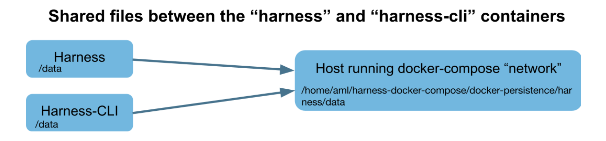

# universal-recommender-experiment
This repo contains execution files and notebooks for a small application of the **universal recommender** on ecommerce data.

For more information on the universal recommender see [ActionML](https://actionml.com/docs/welcome_to_actionml) page.


### Data
For this application ecommerce behaviour data from [Kaggle](https://www.kaggle.com/mkechinov/ecommerce-behavior-data-from-multi-category-store?select=2019-Nov.csv) was used.

### Repository Structure

All the files needed to run the applications are contained in the folder `data`. In particular:
- the bash file `ecommerce-ur.sh` containes all commands to import data, train each recommender and retrieve the results
- the subfolder `engines` containes json files templates of different engines for the universal recommender on ecommerce data
- the subfolder `input_data` containes csv files for training and testing each recommenders
- the subfolder `python` containes python files to send imput data to the recommenders and query the results
- the subfolder `results` containes files with recommended items for each recommender

The folder `notebooks` containes jupyter notebooks with analysis and data preparation.

### Installation Steps

For native installation of Harness and all the dependencies consult the [guide](https://actionml.com/docs/harness_native_guide) from ActionML. The application in this repository
was tested on a docker-container installation. See the [Harness Container Guide](https://actionml.com/docs/harness_container_guide) for a detailed description of the installation steps
or follow the instructions below:

One-line installation via docker-compose:
```
git clone https://github.com/actionml/harness-docker-compose.git && cd harness-docker-compose && cp .env.sample .env && docker-compose up -d --build
```
You should see the universal recommender running on http://localhost:9090

To access the Harness-CLI run:
```
docker-compose exec harness-cli bash
```

For this application the python `requests` library is needed. You can install it from the harness-cli by running:
```
python3 -m pip install requests
```

### How to run the application

All the files needed for this application (everything contained in the `data` folder) must be accessible from the harness-cli. The easiest way to do this is
to map the `data` directory of this repository into the filesystem of harness and harness-cli (i.e. copy everything contained in the `data` folder into
`harness-docker-compose/docker-persistence/harness/data`



Three main recommender are experimented here:
- in the first recommender only **purchase** is considered as the main user action (see the engine template `engines/ecommerce-purchase.json`)
- in the second recommender **purchase** is still the main action and **view** is taken as secondary action (see the engine template `engines/ecommerce-purchase-view.json`)
- in the third recommender **purchase**, **view** and **cart** are taken as user actions (see the engine template `engines/ecommerce-purchase-view-cart.json`)

Each recommender can be run using the `ecommerce-ur.sh` bash file contained in the `data` folder. 
The right train, test and output files should be given as arguments to the bash file. So, for example, to run the
first recommender you can use the following command:

`bash ./data/ecommerce-ur.sh ./data/engines/ecommerce-purchase.json ./data/input_data/2019-Nov-sample-train-eletronics-purch-10kusers.csv ./data/input_data/2019-Nov-sample-test-eletronics-userid-10kusers.csv ./data/results/predictions-ecommerce-eletronics-p-10kusers.json`

The input files (train and test) used for the three recommenders are obtained from the notebook `eCommerceDataSet-Electronics-10kusers.ipynb`
Analysis of the results and performance comparison can be found in the notebook `AnalyseResults-Electronics-10users.ipynb`

### Further experiment

Similarly to the application described above, the bash file in `/data/ecommerce-ur.sh` can be run to explore another type of recommender, where instead of taking item-view
as secondary action, we take category-view: the engine template (`engines/ecommerce-purchase-view-category-num10.json`) does not change 
from the previous experiment but input data is collected differently (instead of item-view we need to send category-view as action to the recommender. See `python/import_ecommerce_data_category.py`)
Data preparation and analysis of the results are contained in the notebooks `eCommerceDataSet-Category.ipynb` and `AnalyseResults-Category.ipynb` respectively.